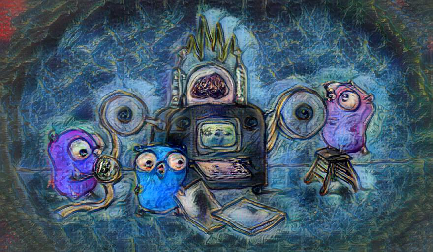

# Vangogh
Vangogh is a command line tool for manipulating images in an artistic manner.

Convert an image into ASCII art.
```
vangogh text --file gopher.png
```

Apply a stylistic transfer of one of Vangogh's paintings onto your image.
Simply pass in a file as `--content` and a Van Gogh `--painting` and a file named `stylized.png` will appear.
The command uses your content as a base for the image and applies an effect which will make the image appear to be a Van Gogh painting.

```
vangogh style --content gophers.png --painting starry
```

The possible `--painting` options are:
* [starry](https://www.vangoghgallery.com/img/starry_night_full.jpg) (default)
* [potato](https://www.vangoghgallery.com/img/potato_full.jpg)
* [sunflower](https://www.vangoghgallery.com/img/sunflower_full.jpg)
* [poppies](https://www.vangoghgallery.com/img/poppies_full.jpeg)
* [irises](https://www.vangoghgallery.com/img/irises_full.jpeg)
* [bedroom](https://www.vangoghgallery.com/img/bedroom_full.jpeg)
* [cafe](https://www.vangoghgallery.com/img/cafe_full.jpeg)
* [mulberry](https://www.vangoghgallery.com/img/mulberry_full.jpg)
* [blossom](https://www.vangoghgallery.com/img/blossom_full.jpeg)

To use this command please set the `VANGOGH_API_KEY` environment variable to your own API key or the sample found on [Deep AI](https://deepai.org/machine-learning-model/fast-style-transfer).

| Content       | Painting      | Result  |
| ------------- | ------------- | ------- |
|  |  |  |
